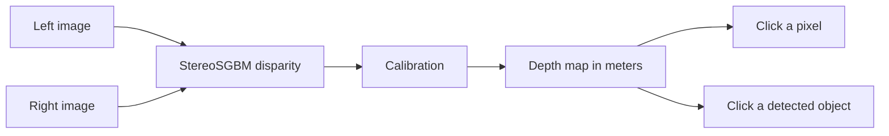

# Stereo Object Distance Estimation

Stereo vision project for estimating scene depth from a rectified left/right image pair, then turning that depth map into interactive pixel and object distance inspection.

## Visual Overview

<table>
  <tr>
    <td align="center">
      <b>Left image</b><br>
      
    </td>
    <td align="center">
      <b>Right image</b><br>
      
    </td>
  </tr>
  <tr>
    <td align="center">
      <b>Disparity</b><br>
      
    </td>
    <td align="center">
      <b>Depth</b><br>
      
    </td>
  </tr>
</table>

## What This Project Does

- Loads a stereo pair and checks that both images align.
- Computes disparity with OpenCV StereoSGBM.
- Converts disparity into approximate metric depth.
- Lets you inspect depth by clicking a pixel region or a detected object.
- Uses YOLO for object selection when you want a more practical distance reading.

## Pipeline



## Core Idea

Stereo depth relies on one simple relationship:

$$Z = \frac{f \cdot B}{d}$$

Where:

- $Z$ is depth in meters
- $f$ is focal length in pixels
- $B$ is camera baseline in meters
- $d$ is disparity in pixels

Smaller disparity means the object is farther away. Larger disparity means it is closer.

## Repository Structure

```text
src/
  core/
    calibration.py      # calibration parsing
    stereo_depth.py     # pair loading, disparity, depth conversion
  interactive/
    click_depth.py      # local depth from a clicked point
    object_depth.py     # robust depth from a detected box

scripts/
  run_depth_demo.py         # generates disparity/depth outputs
  click_depth_ui.py         # click anywhere to inspect depth
  click_object_depth_ui.py  # YOLO + object distance UI

data/
  sample/               # stereo pair and calibration sample
  KITTI_RAW DATA/       # dataset folder used by the project

outputs/
  disparity.png         # generated visualization
  depth.png             # generated visualization
  depth.npy             # generated metric depth array
```

## How It Feels To Use

### Pixel depth

Run the click-based depth UI when you want a quick local estimate around a point in the scene.

### Object depth

Run the object workflow when you want a cleaner reading for an actual object, not just a single pixel.

## Setup

```bash
python -m pip install -r requirements.txt
```

Dependencies:

- opencv-python
- numpy
- matplotlib
- ultralytics

## Run It

Generate the sample disparity and depth outputs:

```bash
python scripts/run_depth_demo.py
```

Then inspect the interactive tools:

```bash
python scripts/click_depth_ui.py
python scripts/click_object_depth_ui.py
```

## Notes

- The sample stereo pair lives in [data/sample/left/000000_10.png](data/sample/left/000000_10.png) and [data/sample/right/000000_10.png](data/sample/right/000000_10.png).
- The generated visuals are written to [outputs/disparity.png](outputs/disparity.png) and [outputs/depth.png](outputs/depth.png).
- Stereo results are approximate and work best on rectified, well-textured scenes.

Creates:

- `outputs/disparity.png`
- `outputs/depth.png`
- `outputs/depth.npy`

### 8.2 Pixel click UI

```bash
python scripts/click_depth_ui.py
```

Click anywhere to print/display local depth estimate.

### 8.3 Object click UI (YOLO + depth)

```bash
python scripts/click_object_depth_ui.py
```

Controls:

- Left click: estimate depth for clicked detection
- `m`: toggle spatial method (`select` / `weighted`)
- `q` or `Esc`: quit

---

## 9) Validation Scripts

```bash
python scripts/test_estimate_box_depth.py
python scripts/test_object_depth.py
```

Notes:

- `test_object_depth.py` expects `outputs/depth.npy` (run `run_depth_demo.py` first).
- Sample image placeholders may need real stereo files placed in the expected paths.

---

## 10) Limitations and Failure Cases

This project intentionally keeps the pipeline simple. Current limitations include:

- sensitivity to calibration/rectification quality,
- weak performance in textureless/reflective/occluded regions,
- unstable depth for far objects with tiny disparity,
- approximate object distance due to box-level aggregation,
- no confidence map or uncertainty estimation,
- no quantitative benchmarking against ground truth in current scripts.

---

## 11) Future Improvements

- Parse official KITTI calibration files directly.
- Add CLI arguments for custom image/calibration paths.
- Add confidence-based filtering and invalid-pixel handling.
- Benchmark against KITTI disparity/depth ground truth.
- Add temporal smoothing for video sequences.
- Improve interactive UI with richer overlays and diagnostics.
- Explore deep stereo/depth baselines for comparison.

---

## 12) Summary

The project teaches the practical bridge from stereo geometry to interactive distance estimation:

**stereo pair → disparity → metric depth → robust point/object distance inspection**.

It is a strong foundation for further work in autonomous driving perception, robotics, and 3D scene understanding.
